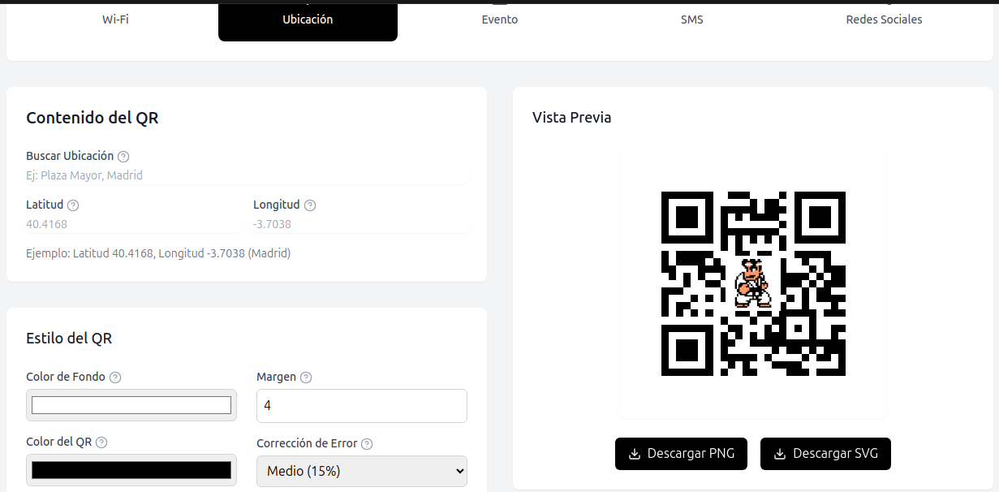
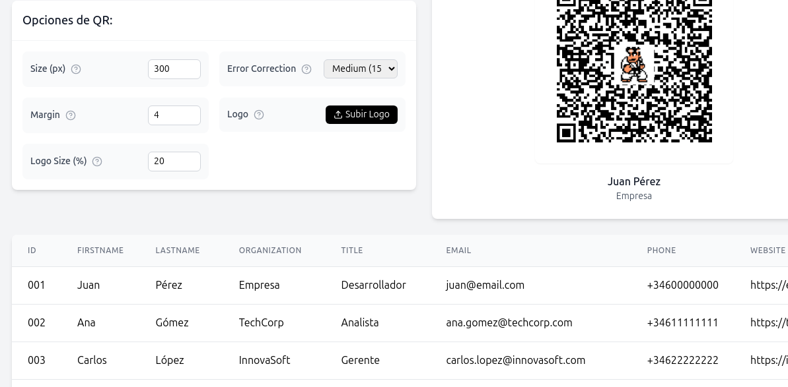

# Generador de Códigos QR

Aplicación web para la generación de códigos QR profesionales con dos modos principales:
- Generación masiva de QRs para credenciales (Lanyards)
- Generación individual de QRs para múltiples usos

## 🚀 Características

### Generales
- Interfaz moderna y responsiva con Tailwind CSS
- Soporte multiidioma (Español/Inglés)
- Previsualización en tiempo real
- Múltiples formatos de descarga (PNG/SVG)
- Personalización completa del diseño
- Integración de logos

### QR Lanyards
- Carga masiva de datos mediante CSV
- Generación de vCards profesionales
- Vista previa y edición de datos
- Empaquetado automático en ZIP
- Validación de datos en tiempo real

### Otros QR


Soporta múltiples tipos de contenido:
- URLs
- Texto plano
- Tarjetas de contacto (vCard)
- Email
- Teléfono
- WiFi
- Ubicación geográfica
- Eventos de calendario
- SMS
- Redes sociales

## 🛠️ Tecnologías

- **Frontend**: React + TypeScript
- **Estilos**: Tailwind CSS
- **Iconos**: Lucide React
- **Generación QR**: qrcode.js
- **Procesamiento CSV**: PapaParse
- **Empaquetado**: JSZip

## 📦 Instalación

```bash
# Clonar el repositorio
git clone https://github.com/686f6c61/generador-QR.git

# Instalar dependencias
npm install

# Iniciar en modo desarrollo
npm run dev

# Construir para producción
npm run build
```

## 🔧 Uso

### Generación Masiva (QR Lanyards)




1. Descarga la plantilla CSV
2. Completa la información de los contactos
3. Sube el archivo CSV
4. Configura las opciones del QR
5. Añade un logo (opcional)
6. Genera y descarga los códigos QR

#### Estructura del CSV

El archivo CSV debe contener los siguientes campos:

```csv
firstName,lastName,organization,title,email,phone,website,address
```

| Campo | Descripción | Requerido | Ejemplo |
|-------|-------------|-----------|----------|
| firstName | Nombre de la persona | Sí | Juan |
| lastName | Apellidos | Sí | Pérez García |
| organization | Empresa u organización | No | Empresa S.A. |
| title | Cargo o posición | No | Director Técnico |
| email | Correo electrónico | Sí | juan.perez@empresa.com |
| phone | Teléfono (formato internacional) | Sí | +34 600000000 |
| website | Sitio web | No | https://www.empresa.com |
| address | Dirección postal | No | Calle Principal 123, Madrid |

#### Validaciones

- **Email**: Debe ser una dirección de correo válida
- **Teléfono**: Formato internacional con prefijo de país
- **Máximo**: 150 registros por archivo
- **Formato**: UTF-8 con separador de coma (,)

### Generación Individual (Otros QR)

#### Tipos Soportados

1. **URL**
   - URLs web completas
   - Validación de formato

2. **Texto**
   - Texto plano
   - Límite de 300 caracteres

3. **vCard**
   - Información completa de contacto
   - Formato vCard 3.0

4. **Email**
   - Dirección de correo
   - Asunto predefinido
   - Cuerpo del mensaje

5. **Teléfono**
   - Formato internacional
   - Marcación directa

6. **WiFi**
   - SSID y contraseña
   - Soporte WPA/WEP/Sin contraseña
   - Redes ocultas

7. **Ubicación**
   - Coordenadas GPS
   - Búsqueda por nombre

8. **Calendario**
   - Título y descripción
   - Fecha y hora
   - Ubicación
   - Eventos de día completo

9. **SMS**
   - Número de teléfono
   - Mensaje predefinido

10. **Redes Sociales**
    - Twitter
    - LinkedIn
    - Facebook
    - Instagram

#### Opciones de Personalización

- **Colores**
  - Color de fondo
  - Color del QR
  
- **Dimensiones**
  - Tamaño (100-1000px)
  - Margen (0-10)
  
- **Técnicas**
  - Nivel de corrección de errores (L/M/Q/H)
  - Estilo de esquinas (cuadradas/redondeadas)
  
- **Logo**
  - Subida de imagen
  - Tamaño ajustable (10-30%)
  - Máximo 500KB

## 🎨 Personalización

### Estilos

La aplicación utiliza Tailwind CSS para los estilos. Para personalizar:

1. Modifica `tailwind.config.js` para ajustar:
   - Colores
   - Tipografía
   - Espaciado
   - Breakpoints

2. Extiende los estilos en `index.css`

### Traducciones

Las traducciones se gestionan en `src/utils/i18n.ts`:

1. Añade nuevos idiomas al objeto `languages`
2. Implementa todas las claves requeridas
3. Actualiza el selector de idiomas en el componente `Header`

## 📄 Licencia

MIT License - ver [LICENSE.md](LICENSE.md) para más detalles

## 🤝 Contribuir

1. Fork del repositorio
2. Crea una rama para tu feature (`git checkout -b feature/AmazingFeature`)
3. Commit de tus cambios (`git commit -m 'Add some AmazingFeature'`)
4. Push a la rama (`git push origin feature/AmazingFeature`)
5. Abre un Pull Request
