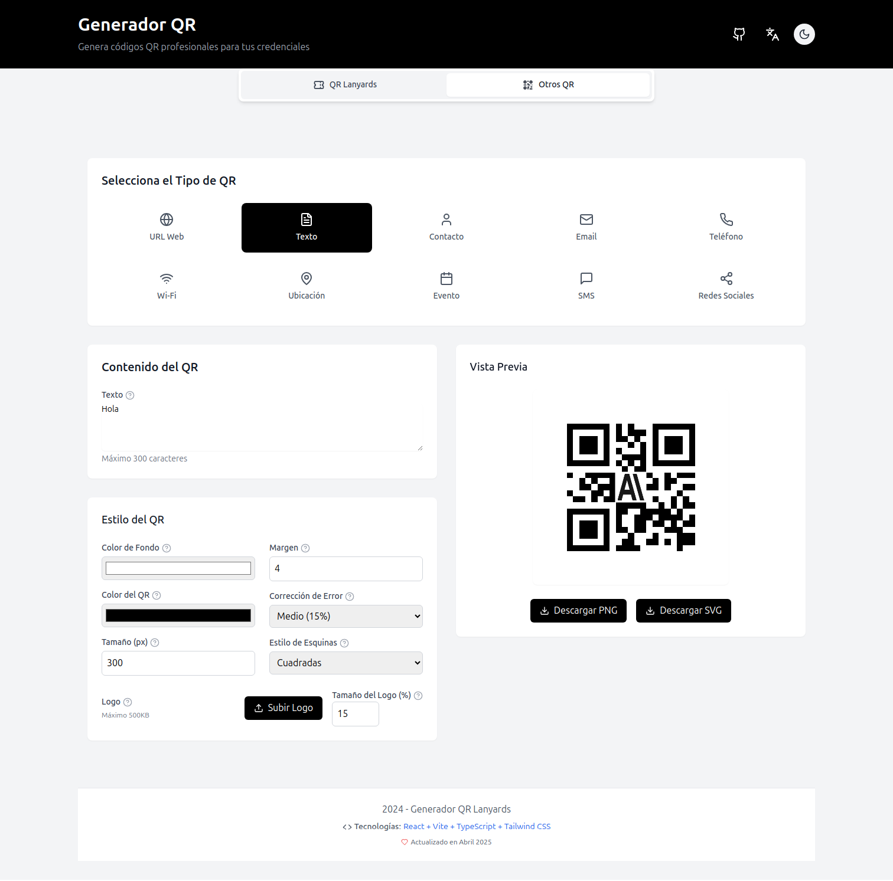
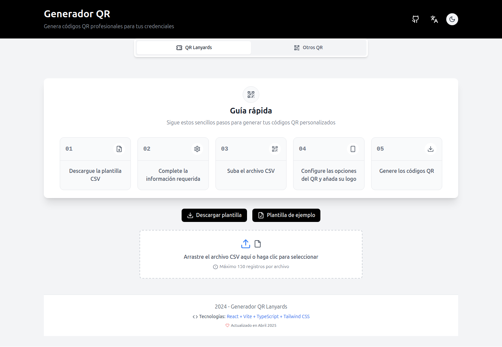

<div align="center">

# 🔄 Generador de Códigos QR

*Versión 0.2 | Actualizado: Abril 2025*

<p>
  
  
  
  
  
  
</p>

<p>Aplicación web profesional para la generación de códigos QR avanzados</p>
</div>

## 📋 Descripción

Generador de Códigos QR es una aplicación moderna y potente que ofrece dos modos principales de funcionamiento:

- ✨ **Generación masiva** de QRs para credenciales (Lanyards)
- ✨ **Generación individual** de QRs para múltiples usos

## 📦 Instalación

```bash
# Clonar el repositorio
git clone https://github.com/686f6c61/generador-QR.git

# Navegar al directorio
cd generador-QR

# Instalar dependencias
npm install

# Iniciar en modo desarrollo
npm run dev
```

### 📋 Requisitos

- Node.js 18.0 o superior
- NPM 8.0 o superior

## 🧩 Modos de uso

La aplicación ofrece dos modos principales para satisfacer diferentes necesidades:

### 1. 📱 Generación individual (Otros QR)

<div align="center">
  
</div>

Crea códigos QR individuales para una variedad de propósitos con estos tipos disponibles:

| Tipo | Descripción | Datos incluidos |
|------|-------------|------------------|
| 🌐 **URL** | Enlaces web directos | URL completa |
| 📝 **Texto** | Mensajes personalizados | Hasta 300 caracteres |
| 👤 **vCard** | Tarjetas de contacto | Datos personales y profesionales |
| 📧 **Email** | Correo electrónico | Dirección, asunto y cuerpo |
| 📞 **Teléfono** | Números telefónicos | Marcación directa |
| 📶 **WiFi** | Redes inalámbricas | SSID, contraseña y tipo de cifrado |
| 📍 **Ubicación** | Datos geográficos | Coordenadas de latitud y longitud |
| 📅 **Calendario** | Eventos | Título, fecha, hora y ubicación |
| 💬 **SMS** | Mensajes de texto | Número y texto predefinido |
| 🔗 **Social** | Redes sociales | Enlaces a perfiles |

### 2. 🏷️ Generación masiva (QR Lanyards)

<div align="center">
  
</div>

Genera múltiples códigos QR para credenciales o tarjetas de contacto siguiendo estos pasos:

1. 📥 **Descarga una plantilla CSV** (vacía o con ejemplos)
2. 📝 **Completa la información** de los contactos
3. 📤 **Sube el archivo CSV** a la aplicación
4. ⚙️ **Configura las opciones** (colores, tamaño, etc.)
5. 🖼️ **Añade un logo** (opcional)
6. ✅ **Genera y descarga** los códigos QR empaquetados en ZIP

#### 📂 Plantillas disponibles

Puedes elegir entre dos opciones:

**A. 📝 Plantilla vacía**
```csv
firstName,lastName,organization,title,email,phone,website,address
```

**B. 📊 Plantilla con datos de ejemplo**
```csv
firstName,lastName,organization,title,email,phone,website,address
Sundar,Pichai,Google,CEO,sundar@example.com,+1-650-555-1234,google.com,"1600 Amphitheatre Parkway, Mountain View, CA"
Susan,Wojcicki,YouTube,CEO,susan@example.com,+1-650-555-2345,youtube.com,"901 Cherry Ave, San Bruno, CA"
Kent,Walker,Google,SVP Global Affairs,kent@example.com,+1-650-555-3456,google.com,"1600 Amphitheatre Parkway, Mountain View, CA"
# ... y 27 registros más
```

#### 📋 Estructura del CSV

| Campo | Descripción | Requerido | Ejemplo |
|-------|-------------|:---------:|---------|
| firstName | Nombre de la persona | ✅ | Juan |
| lastName | Apellidos | ✅ | Pérez García |
| organization | Empresa u organización | ❌ | Empresa S.A. |
| title | Cargo o posición | ❌ | Director Técnico |
| email | Correo electrónico | ✅ | juan.perez@empresa.com |
| phone | Teléfono (formato internacional) | ✅ | +34 600000000 |
| website | Sitio web | ❌ | https://www.empresa.com |
| address | Dirección postal | ❌ | Calle Principal 123, Madrid |

#### ✅ Validaciones aplicadas

- **📧 Email**: Debe ser una dirección de correo válida
- **📞 Teléfono**: Formato internacional con prefijo de país
- **📊 Capacidad**: Máximo 150 registros por archivo
- **📁 Tamaño**: Archivos de hasta 5MB

## ✨ Características generales

- 🎨 **Interfaz moderna** y responsiva con Tailwind CSS
- 🌍 **Soporte multiidioma** (Español/Inglés)
- 👁️ **Previsualización** en tiempo real
- 📦 **Múltiples formatos** de descarga (PNG/SVG)
- 🖼️ **Personalización completa** de colores, tamaño y logos
- 🌙 **Modo claro/oscuro** (predeterminado: claro)

### ⚙️ Opciones de personalización de QR

| Categoría | Opciones disponibles |
|-----------|----------------------|
| **🎨 Colores** | Color de fondo, Color del código QR |
| **💾 Dimensiones** | Tamaño (100-1000px), Margen (0-10) |
| **⚙️ Técnicas** | Nivel de corrección de errores (L/M/Q/H), Estilo de esquinas (cuadradas/redondeadas) |
| **🖼️ Logo** | Subida de imagen personalizada (máx. 500KB), Tamaño ajustable (10-30%) |

## 🛠️ Tecnologías utilizadas

| Categoría | Tecnología | Versión |
|-----------|------------|----------|
| **🧩 Framework** | [React](https://reactjs.org/) | 18.2 |
| **📘 Lenguaje** | [TypeScript](https://www.typescriptlang.org/) | 5.2 |
| **🎨 Estilos** | [Tailwind CSS](https://tailwindcss.com/) | 3.4 |
| **⚡ Build** | [Vite](https://vitejs.dev/) | 5.4 |
| **🔣 Iconos** | [Lucide React](https://lucide.dev/) | 0.292 |
| **🔄 QR** | [qrcode.js](https://github.com/soldair/node-qrcode) | 1.5 |
| **📊 CSV** | [PapaParse](https://www.papaparse.com/) | 5.4 |
| **📦 ZIP** | [JSZip](https://stuk.github.io/jszip/) | 3.10 |

## 📈 Próximas mejoras

- 🔒 Autenticación de usuarios
- 🔄 Sincronización con servicios en la nube
- 📲 Aplicación móvil complementaria
- 🌈 Más opciones de personalización
- 🧠 IA para generación automática de contactos

## 📄 Licencia

Este proyecto está licenciado bajo la [Licencia MIT](LICENSE).

---

<div align="center">

**Desarrollado con ❤️ | Abril 2025 | v0.2**

</div>
